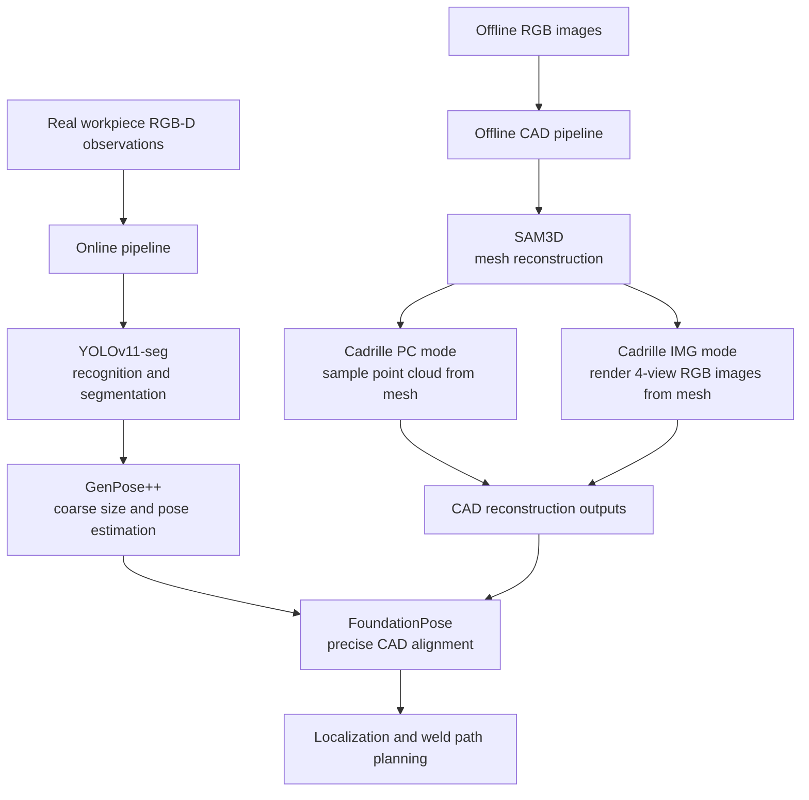

# AIWS

AIWS is split into two connected parts:

- an **online vision pipeline** used during on-site welding
- an **offline CAD reconstruction pipeline** used before deployment to build the CAD model database

This repository is the AIWS integration layer. It keeps AIWS-specific scripts, docs, and workflow glue here, while the upstream model repos are tracked as submodules under `repos/`.

## Pipeline overview



## Repository layout

```text
AIWS/
├── repos/               # upstream model repos tracked as submodules
│   ├── sam-3d-objects/   # upstream SAM3D repo
│   └── cadrille/         # upstream Cadrille repo
├── runtime/             # AIWS-owned runtime assets (checkpoints, caches, prepared data)
├── scripts/             # AIWS orchestration, wrappers, and experiment runners
├── docs/                # reports, SOPs, technical records, and outlines
├── gui/                 # local GUI for launching and inspecting runs
├── outputs/             # local generated artifacts and previews
└── aiws5.2-usable*/     # local dataset views used in experiments
```

## Upstream repos used by AIWS

- `repos/sam-3d-objects`
  - upstream SAM3D codebase
  - main entry points used by this workflow include `demo.py`, `notebook/inference.py`, and `checkpoints/hf/pipeline.yaml`
- `repos/cadrille`
  - upstream Cadrille codebase
  - main entry points used by this workflow include `test.py` and `evaluate.py`

## AIWS-specific integration code

### Cadrille wrappers around the upstream repo

- `scripts/cadrille_infer_wrapper.py`
  - thin AIWS wrapper around the Cadrille inference flow, adding processor/checkpoint override, sample-count control, batch-size control, and GPU-memory logging
- `scripts/cadrille_evaluate_wrapper.py`
  - thin AIWS wrapper around the Cadrille evaluation flow, adding CAD materialization, best-candidate selection, and metrics output

### Main offline pipeline scripts

- **Data preparation**
  - `scripts/dataset_usable_view_build.py`
  - `scripts/dataset_instance_masks_generate.py`
- **SAM3D**
  - `scripts/sam3d_batch.py`
  - `scripts/sam3d_run_metrics_analysis.py`
- **Cadrille**
  - `scripts/cadrille_batch.py`
  - `scripts/cadrille_run_metrics_analysis.py`
- **End-to-end bridge/orchestration**
  - `scripts/e2e_sam3d_to_cadrille.py`

## Clone and initialize

```bash
git clone <your-aiws-repo-url>
cd AIWS
git submodule update --init --recursive
```

If you already cloned the repo before submodules were added:

```bash
git submodule sync --recursive
git submodule update --init --recursive
```

## What this repo is responsible for

This repo is meant to contain:

- AIWS project documentation
- AIWS dataset-view builders and experiment runners
- wrapper code that adapts upstream model repos to the AIWS workflow
- local GUI and analysis tooling

This repo is **not** meant to vendor large upstream codebases directly into AIWS when a clean submodule can track them instead.

## Runtime asset ownership

Model checkpoints and prepared runtime data should live under AIWS-owned runtime paths, not inside the upstream repos.

- preferred Cadrille runtime root: `runtime/cadrille/`
- example paths:
  - `runtime/cadrille/ckpt/`
  - `runtime/cadrille/data/`

This keeps upstream repos under `repos/` clean and treats checkpoints and prepared data as AIWS runtime state.

## Current focus

The current documented workflow focuses on the **offline CAD reconstruction pipeline**:

- offline RGB images
- SAM3D mesh reconstruction
- Cadrille CAD reconstruction from mesh-derived PC or IMG inputs
- downstream analysis, evaluation, and reporting
